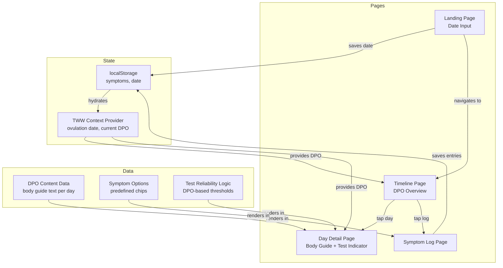

# Design

_Architecture, decisions, stack, diagram (mermaid)._

---

## Feature Architecture

---

## Component Breakdown

### Landing Page (`/`)
| Component | Purpose |
|---|---|
| `HeroSection` | Expressive heading, warm tagline, decorative elements |
| `DatePicker` | Ovulation date input (calendar or simple date selector) |
| `CTAButton` | Dark pill button → "Start My TWW" |

### Timeline Page (`/timeline`)
| Component | Purpose |
|---|---|
| `TimelineHeader` | Current DPO highlight, days remaining |
| `DayCard` | Individual day card (DPO number, mini status, symptom dots) |
| `TestIndicator` | Banner showing test reliability for today |
| `EncouragementBanner` | Rotating warm micro-copy |

### Day Detail Page (`/day/:dpo`)
| Component | Purpose |
|---|---|
| `BodyGuide` | What's happening in the body text |
| `TestStatus` | Detailed "Should I test?" message for this day |
| `SymptomSummary` | What was logged for this day (if anything) |
| `LogCTA` | Quick link to log symptoms for today |

### Symptom Log Page (`/log`)
| Component | Purpose |
|---|---|
| `SymptomChips` | Tappable predefined symptom pills |
| `NoteInput` | Optional free-text area |
| `SaveButton` | Saves to localStorage under current DPO |
| `PastEntries` | View previously logged days |

---

## Key Technical Decisions

| Decision | Choice | Rationale |
|---|---|---|
| Date input UX | Native HTML date input + custom styling | Most reliable on mobile, no heavy date picker library |
| DPO calculation | `differenceInDays(today, ovulationDate)` via date-fns | Simple, accurate |
| Content storage | Static JSON/TS file for DPO body guide | No fetching needed, works offline |
| Symptom persistence | localStorage keyed by `tww-symptoms-dpo-{n}` | Simple, private, per-day |
| Test indicator logic | Pure function mapping DPO → reliability tier | Easy to test, no state needed |